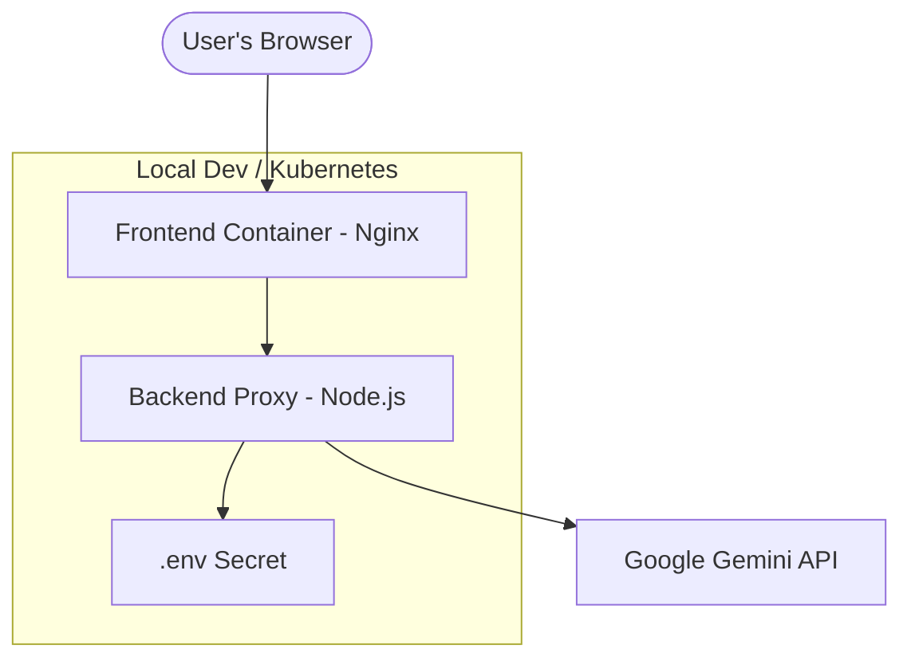
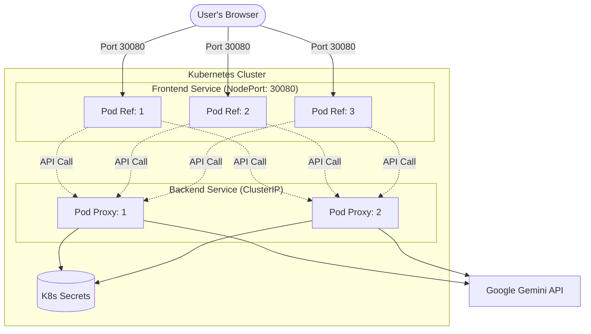

# Hamza Al-Ahdal Portfolio 🤖

Modern AI-powered portfolio website featuring a responsive design and an interactive Gemini-powered chatbot with voice capabilities.

## � Project Structure

- **`frontend/`**: The client-side application (HTML, CSS, JS).
- **`backend/`**: Node.js Express server that proxies API requests to Gemini (keeps your API key safe).
- **`infra/`**: Docker and Kubernetes configuration files.
- **`assets/`**: High-quality downloadable assets (e.g., CV PDF).

## 🏗️ Architecture

The application is built using a modern, containerized architecture that separates concerns for security and scalability.



### Component Details:
- **Frontend**: A lightweight Nginx container serving static assets from the `frontend/` directory.
- **Backend Proxy**: A Node.js Express server that handles AI requests to keep the `GEMINI_API_KEY` hidden from the client browser.
- **Infrastructure**: Dockerized services orchestrated by Kubernetes for local development consistency.


## 🐳 Docker Setup

To run the portfolio in containers:

1. **Build Frontend**: `docker build -f infra/Dockerfile -t portfolio-frontend .`
2. **Build Backend**: `docker build -t portfolio-backend ./backend`

## ☸️ Kubernetes (Production-Grade)

The production setup uses multiple replicas and dedicated deployments for the frontend and backend.

1. **Configure Secrets**:
   Update `infra/k8s-secrets.yaml` with your API key, then apply:
   ```bash
   kubectl apply -f infra/k8s-secrets.yaml
   ```

2. **Deploy Components**:
   ```bash
   kubectl apply -f infra/k8s-backend.yaml
   kubectl apply -f infra/k8s-frontend.yaml
   ```

3. **Verify Status**:
   ```bash
   kubectl get pods -l 'app in (portfolio-frontend, portfolio-backend)'
   ```

## 🏗️ Architecture (Scaling)



### Production Features:
- **Replicas**: 3x Frontend and 2x Backend pods for failover.
- **Resource Limits**: Prevents containers from consuming too much memory/CPU.
- **Health Probes**: Auto-restarts pods if they become unresponsive.
- **Native Secrets**: API keys are managed by Kubernetes Secrets, not text files.

